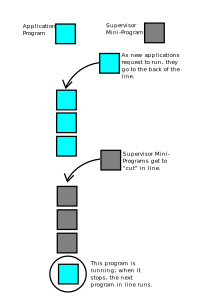

# How Atlas Paved The Way for Operating Systems

The computer you're reading this article on (or that it was printed from) most likely has an operating system, and you may have thought nothing about where it came from or why it's there. The idea of an operating system has a history, and one operating system that has been particularly important was made for one computer: Atlas.

In order to understand how Atlas's operating system worked, one must first understand how computers work in general. Most computers, at least in the 1960s, had four basic components: A processor for running programs, main memory for storing programs and data temporarily, slower storage for storing programs and data more permanently, and input and output (I/O) devices for interacting with the computer.

When Atlas was constructed, it had a major problem. Its various I/O devices were far slower than its processor! If the computer had been run with one program at a time, as was typical for the time, it would have been incredibly slow and inefficient. For instance, imagine a hypothetical program that has 10,000 instructions for the processor and has to punch out 10,000 characters onto paper tape, one of Atlas's I/O devices. This program would take over 90 seconds due to I/O despite the actual processing only taking 0.02 seconds! To solve this problem, the team behind Atlas created a program called the Atlas Supervisor.

The Supervisor was a program that directly controlled, or operated, Atlas. For this reason, it was also called an operating system. Of course, just operating a computer isn't useful by itself. As a result, the programs that normally would be loaded and run directly on Atlas's hardware were instead loaded and run by the Supervisor. These useful programs would now be called application programs. In order for this scheme to work, special hardware was needed.

A program consists of instructions. Normally, a processor would execute these instructions one at a time with no way to interrupt it. For the Supervisor to work, applications and I/O devices needed a way to interrupt the execution of a program. To do so, hardware was added to the processor such that when something interrupted a program, the processor would execute a certain part of the Supervisor called an interrupt routine before returning back to what it was doing. As we will see, this was incredibly useful for Atlas.

One use of interrupts was for I/O. What I/O was available on Atlas changed over time; paper tape readers and writers, punch card readers and writers, and teleprinters were all used at some point in Atlas. Don't worry if you've never heard of these; just know that there were a lot of I/O devices of different types. Only the Supervisor could access these devices, so applications had to request the Supervisor to read input or write output via interrupts. This may sound annoying, but given the many I/O devices on Atlas, it was more convenient for application programmers to ask the Supervisor to take care of I/O rather than to do it themselves.

The Supervisor also allowed Atlas to be used for storage. Unlike modern computers, Atlas's memory actually remained even after the computer was turned off. As such, storage wasn't as big a concern as it would be in modern computers. The result was that there were no file formats or folders in Atlas. All storage was just in one big file in each of Atlas's 8 magnetic tapes. Like with I/O, interrupts allowed applications to tell the Supervisor what to do with the tape.

While making the usage of I/O and storage easier was a huge help for programmers, the Supervisor needed to actually run these applications. To do so, the Supervisor had to schedule the running of not just application programs, but it also had to schedule mini-programs called routines in the Supervisor itself. Since the processor could only run one program or routine at a time, this was not a straightforward problem. Despite these limitations, the creators of Atlas found a clever way to seemingly run multiple programs at once.

In order to schedule programs, the Supervisor used a routine called a priority scheduler. Think of the routines and applications as being in a line. When an application requests to run, the scheduler puts it at the back of this line. When the application reaches the front it runs. For routines, the process is very similar; the only difference is that they can "cut" in front of the applications in line.

---

### Infographic: Scheduling in Atlas

The Atlas computer had many programs scheduled to run on its processor. Since the processor could only run one program at a time, this was done as follows:

---

The advantage of having multiple programs in a schedule is that it allowed Atlas to solve its slow I/O problem. When an I/O device is used, the application that uses it is put to the back of the line with a note saying where it stopped. The Supervisor then schedules another program to run. By doing this, Atlas was able to run multiple useful programs at the same time! The hypothetical program that needed 90 seconds waiting on I/O would no longer hold up other programs on Atlas.

The largest problem with this was that Atlas's memory had to be divided between the application programs and the Supervisor. How this was solved is highly technical and complicated, so I'll present a simplified version here. Basically, the Supervisor used a technique called paging to remap Atlas's physical memory to a fake, virtual memory seen by each running application program. This allowed multiple programs to be in memory at the same time without even being aware of the mapping. As a side effect, this made it much harder for programs to interfere with each others' memory, which helped prevent other problems. All of this was especially helpful in Atlas since it had multiple types of physical memory; virtual memory made everything far easier for programmers.

With all of these features, the Atlas Supervisor is the basis for today's operating systems. Today, the separation of programs into application programs and the operating system, the use of interrupts, exclusive operating system access to input and output, the ability to run multiple programs at once, and virtual memory are available in all common operating systems used in 2022. Many of the advances in modern computing would be impossible without the innovations of the Atlas Supervisor.

[Works Cited](Works_Cited.md)
